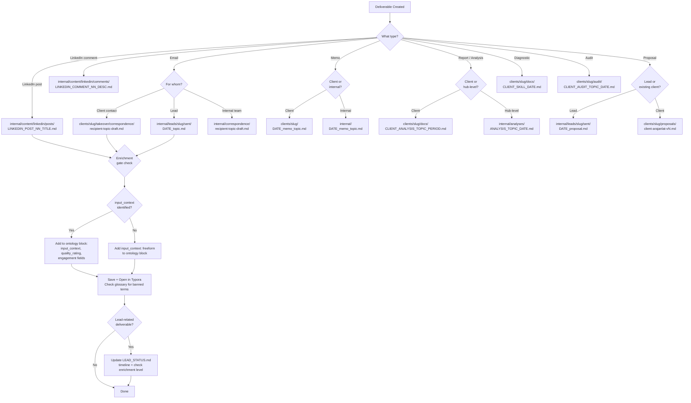

> v1.0 --- 2026-04-10

# Decision Tree: Deliverable Routing

> You've written something. Where does it get saved?
> References: `save-deliverable.md`, `ENRICHMENT_WATERFALL.md`

## Save Location Quick Reference

| Type | Client context | Location |
|---|---|---|
| Email | Client contact | `clients/slug/takeover/correspondence/` |
| Email | Lead | `internal/leads/slug/sent/` |
| Email | Internal | `internal/correspondence/` |
| LinkedIn post | — | `internal/content/linkedin/posts/` |
| LinkedIn comment | — | `internal/content/linkedin/comments/` |
| Memo | Client | `clients/slug/` |
| Memo | Internal | `internal/` |
| Report/Analysis | Client | `clients/slug/docs/` |
| Report/Analysis | Hub | `internal/analyses/` |
| Proposal | Lead | `internal/leads/slug/sent/` |
| Proposal | Client | `clients/slug/proposals/` |
| Diagnostic | Client | `clients/slug/docs/` |
| Audit | Client | `clients/slug/audit/` |
