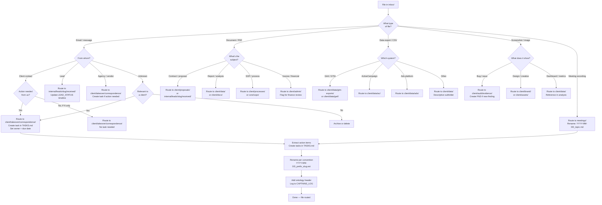

> v1.0 --- 2026-04-10

# Decision Tree: Inbox Triage

> A file lands in inbox/. Where does it go?
> References: `core/sops/arcanian/09-inbox-management.md`, `FILE_INTAKE_RULE.md`

## Routing Quick Reference

| Input | Destination | Task? |
|---|---|---|
| Client email with action | `client/takeover/correspondence/` | Yes |
| Client email FYI | `client/takeover/correspondence/` | No |
| Lead reply | `internal/leads/slug/received/` | Update LEAD_STATUS |
| Meeting recording | `client/meetings/` or `internal/meetings/` | Extract tasks |
| Data export | `client/data/{source}/` | No |
| Screenshot of issue | `client/audit/evidence/` | Create FND |
| Contract/proposal | `client/proposals/` | Review task |

## Rules
- No file stays in inbox/ > 7 days
- Every routed file gets YYYY-MM-DD prefix
- Every routed file gets ontology header
- Every file with action items → tasks extracted to TASKS.md
