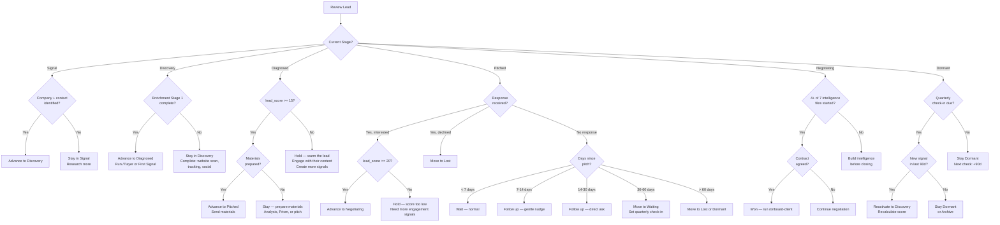

> v1.0 --- 2026-04-10

# Decision Tree: Lead Stage Transitions

> When should a lead advance, hold, or decay?
> References: `LEAD_TRACKING_STANDARD.md`, `SIGNAL_DECAY_MODEL.md`, `ENRICHMENT_WATERFALL.md`

## Score Gate Quick Reference

| Transition | Hard Gate | Soft Gate |
|---|---|---|
| Signal → Discovery | Company + contact identified | — |
| Discovery → Diagnosed | — | Enrichment Stage 1 complete |
| Diagnosed → Pitched | lead_score ≥ 15 | Materials prepared |
| Pitched → Negotiating | lead_score ≥ 20 | Response received |
| Negotiating → Won | — | 4+ intelligence files |
