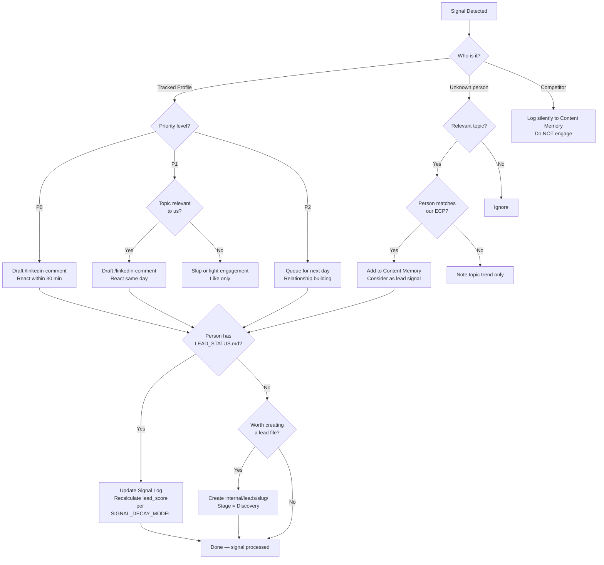

> v1.0 --- 2026-04-10

# Decision Tree: Signal Routing

> When a signal is detected, where does it go?
> References: `SIGNAL_DETECTION_RULE.md`, `SIGNAL_DECAY_MODEL.md`

## Quick Reference

| Signal | Action | Time |
|---|---|---|
| P0 tracked profile posts | `/linkedin-comment` + lead score update | 30 min |
| P1 relevant topic | `/linkedin-comment` + lead score update | Same day |
| P1 irrelevant topic | Like only | When convenient |
| P2 any topic | Light engagement | Next day |
| Unknown person, relevant, matches ECP | Content Memory + consider lead | Same day |
| Competitor posts | Log to Content Memory, analyze silently | No engagement |
