> v1.0 --- 2026-04-10

# Decision Tree: SOP Selection

> The user needs a process. Which SOP applies?
> References: `SOP_INDEX.md`, `SOP_AUTO_SURFACE_RULE.md`

```mermaid
graph TD
    A[Task / Request] --> B{What domain?}
    
    B -->|Email / Newsletter / AC| C{Specific action?}
    B -->|Tracking / Measurement| D{Specific action?}
    B -->|Campaign / Ads| E[SOP 05: Campaign Management<br/>+ client processes/05-*]
    B -->|Lead / Contact / CRM| F[SOP 02: Lead Lifecycle<br/>+ client processes/02-*]
    B -->|Budget / Spend / Invoice| G[SOP 03: Financial Controls]
    B -->|Agency / Vendor| H{New or existing?}
    B -->|Client work| I{Phase?}
    B -->|Audit / Measurement audit| J{Which phase?}
    B -->|Internal / Arcanian| K{What activity?}
    
    C -->|Automation / flow setup| L[SOP 06: Email Automation<br/>+ client processes/06-*]
    C -->|Send newsletter| M[SOP 06 + client<br/>newsletter-process SOP]
    C -->|List / segment management| N[SOP 06 Section: Lists]
    
    D -->|GA4 / GTM setup| O[SOP 04: Measurement & Reporting]
    D -->|Pixel / CAPI| P[SOP 04 + platform-specific<br/>audit SOP]
    D -->|Report / dashboard| Q[SOP 04 Section: Reporting]
    D -->|Consent / GDPR| R[SOP 04 Section: Consent<br/>+ measurement-audit/03]
    
    H -->|New vendor onboard| S[SOP 07: Vendor Access]
    H -->|Existing agency coord| T[SOP 01: Agency Coordination]
    
    I -->|Explore| U[Delivery Phase 1<br/>/pipeline discovery]
    I -->|Plan| V[Delivery Phase 2<br/>Constraint mapping]
    I -->|Architect| W[Delivery Phase 3<br/>Repair planning]
    I -->|Implement| X[Delivery Phase 4<br/>Execute tasks per TASKS.md]
    I -->|Review| Y[Delivery Phase 5<br/>Knowledge extraction]
    I -->|Monitor| Z[Delivery Phase 6<br/>@monitor tasks]
    
    J -->|Phase 1: Inventory| AA[measurement-audit/01]
    J -->|Phase 2: Config| AB[measurement-audit/02]
    J -->|Phase 3: Consent| AC[measurement-audit/03]
    J -->|Phase 4: Data Quality| AD[measurement-audit/04]
    J -->|Phase 5: Reporting| AE[measurement-audit/05]
    J -->|Phase 6: Recommendations| AF[measurement-audit/06]
    
    K -->|New client| AG[SOP: Client Onboarding<br/>/onboard-client]
    K -->|Inbox triage| AH[SOP 09: Inbox Management<br/>/inbox-process]
    K -->|Memo → tasks| AI[SOP 11: Memo to Tasks]
    K -->|Deliverable save| AJ[save-deliverable behavior rule]
    K -->|Meeting processing| AK[SOP 10: Meeting Processing]
```

## Keyword-to-SOP Quick Reference

| Keywords | SOP | Path |
|---|---|---|
| email, newsletter, AC, automation | 06: Email Automation | `marketing-ops/06-email-automation.md` |
| agency, Intren, GD, Vision | 01: Agency Coordination | `marketing-ops/01-agency-coordination.md` |
| tracking, GA4, GTM, pixel, measurement | 04: Measurement & Reporting | `marketing-ops/04-measurement-reporting.md` |
| campaign, launch, UTM, ad | 05: Campaign Management | `marketing-ops/05-campaign-management.md` |
| lead, contact, scoring, pipeline | 02: Lead Lifecycle | `marketing-ops/02-lead-lifecycle.md` |
| budget, spend, invoice | 03: Financial Controls | `marketing-ops/03-financial-controls.md` |
| access, vendor, onboard vendor | 07: Vendor Access | `marketing-ops/07-vendor-access.md` |
| audit, phase X | Measurement Audit 01-06 | `measurement-audit/0X-*.md` |
| onboard client, new client | Client Onboarding | `arcanian/01-client-onboarding.md` |
| memo, deliverable, extract tasks | Memo to Tasks | `arcanian/11-memo-to-tasks.md` |
| inbox, triage | Inbox Management | `arcanian/09-inbox-management.md` |

**Rule:** Always also load client-specific `processes/` SOPs if they exist for the matched topic.
